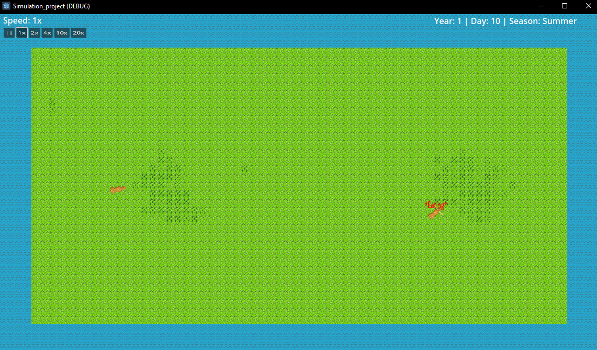

[ENG](#ecosystemsim---nature-simulation-in-godot) | [SV](#ecosystemsim---natursimulering-i-godot)

# EcosystemSim - Nature Simulation in Godot

**EcosystemSim** is a dynamic nature and AI simulation built in Godot, modeling the interactions between animals and plants within an evolving ecosystem. The project aims to simulate survival behavior, symbiosis, reproduction, decay, and environmental effects in a modular and extensible way.

  
*Screenshot from the simulation showing a deer eating and environmental UI elements.*

---

## Structure & Philosophy

The code is built with modularity and inheritance in mind, making it easy to expand and maintain as complexity increases.

### Animal System
The animal class hierarchy is structured as:
```text
Animal
├── Herbivore
│   └── Deer
└── Carnivore
    └── Wolf (planned)
```
This makes it simple to add new species:
- Create the sprite
- Input the species stats (e.g., size, hunger rate, thirst rate, etc.)
- Behavior and systems are inherited from the parent class

Current mechanics include:
- Hunger, thirst and energy management
- Searching for food or water
- Death (with visible corpse graphics and food value)
- Eating and drinking states
- Adjustable simulation speed
- Annual cycle with days and seasons displayed in UI

---

## Planned Features / Roadmap

### Breeding System
- [x] Mating logic
- [x] Pregnancy progress
- [ ] Birth system implementation

### Plant System Rewrite
Refactor from a single `Grass` class to a hierarchical structure:
```text
Plant
├── Tree
├── Bush
└── GroundPlant
    ├── ShortGrass
    └── Reed
```
- Modular expansion of new vegetation types
- Define edibility, spread rate, growth stages, and fire vulnerability

### Environment & Decay
- Fire propagation and destruction
- Decay and nutrient return from corpses and plants
- Soil fertility influence on growth speed

---

## Current Status
This project is under active development and will serve as a long-term portfolio piece and eventual exam project. It is intended as a sandbox for ecosystem design and emergent behavior, not as a traditional game.

---

# EcosystemSim - Natursimulering i Godot

**EcosystemSim** är en natursimulering byggd i Godot där djur, växter och miljön interagerar i ett levande ekosystem. Projektet syftar till att simulera överlevnad, symbios, förökning, nedbrytning och miljöpåverkan i en modulär struktur.

  
*Skärmdump från simuleringen där ett rådjur äter och UI visar miljöinformation.*

---

## Struktur & Designfilosofi

### Djursystem
Djurklasserna är uppdelade enligt följande:

```text
Animal
├── Herbivore
│   └── Deer
└── Carnivore
    └── Wolf (planerad)
```
Det gör det enkelt att lägga till nya djur:
- Skapa grafik
- Ange artens statistik (storlek, hunger, törst, etc.)
- Funktionalitet ärvs från basklasser

Redan implementerat:
- Hunger, törst, energi och död
- Söker efter mat och vatten
- Djur lämnar efter sig kvarlevor (med matvärde)
- Visuella tillstånd som “EATING”
- Tidsreglering: Dag, årstid och simhastighet i UI

---

## Roadmap / Att göra

### Förökningssystem
- [x] Parning
- [x] Dräktighetsprogression
- [ ] Födelsemekanik

### Växtsystem (ny struktur)

Från en enda `Grass`-klass till tydlig arvshierarki:
```text
Plant
├── Tree
├── Bush
└── GroundPlant
    ├── ShortGrass
    └── Reed
```
- Lätt att lägga till nya växttyper
- Definiera ätbarhet, spridning, tillväxtstadier, brandkänslighet

### Miljö och nedbrytning
- Bränder som sprider sig och förstör växtlighet
- Nedbrytning av djurkroppar och växtmaterial
- Jordkvalitet påverkar tillväxthastighet

---

## Status
Projektet är under aktiv utveckling och kommer fungera som ett framtida examensarbete. Det är utformat som en simuleringsplattform för ekosystem och emergenta beteenden, inte som ett spel med mål eller slut.
